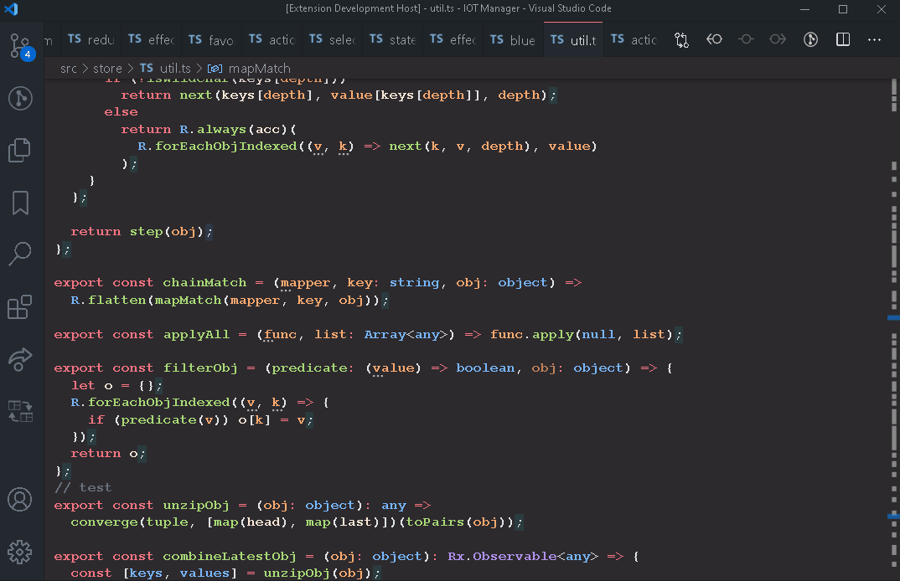

# Navigate Edits History - Bookmarks with Navigation Stack Workflow

## vscode-navigate-edit-history

A Visual Studio Extension for quick searching and navigating edits/marks.

## Features

- Quick access back and forward between edits and marked locations
- Search edits across all files
- Persistent storage edit history
- Bookmarks with stack workflow pattern
- Remove, Create, Toggle edit/mark at location for quick back tracking
- Auto-move edits/marks to top of navigation stack (optional)

## Extension Settings

This extension contributes the following commands (Set in Keyboard Preferences):

- `navigateEditHistory.moveCursorToPreviousEdit`: Edits: Navigate back in edit history
- `navigateEditHistory.moveCursorToPreviousEditInCurrentFile`: Edits: Navigate back in edit history in the current file
- `navigateEditHistory.list`: Edits: List edit history in all files
- `navigateEditHistory.createEditAtCursor`: Edits: Create edit at cursor position (Moves edit to top of stack)
- `navigateEditHistory.removeEditAtCursor`: Edits: Remove any edits on the current line
- `navigateEditHistory.toggleEditAtCursor`: Edits: Toggle any edits on the current line
- `navigateEditHistory.moveCursorCancelNavigation`: Edits: Navigate back to beginning of stack before any jumps
- `navigateEditHistory.clearEdits`: Edits: Clear All Edits

This extension contributes the following settings "Set in User Preferences):

- `navigateEditHistory.maxHistorySize`: Maximum number of entries for the edits history.
- `navigateEditHistory.centerOnReveal`: When navigating to an edit outside the view, should we always put the edit in the center of the screen?
- `navigateEditHistory.groupEditsWithinLines`: Group edits if they are within a certain amount of lines from each other.
- `navigateEditHistory.logDebug`: Log a bunch of stuff to the console. Use if submitting a bug report.
- `navigateEditHistory.topStackWhenQuickPickSelect`: Move edit to top of stack on quick pick select.
- `navigateEditHistory.topStackWhenMove`: Move edit to top of stack on cursor position change

## Workflow Guide

Yet another edit history navigator extension for VsCode. Offers a command to go one step further back in edit history, defaults to KeyBinding ctrl+q. Any navigation or selection will reset the command to once again go to the latest edit. Any edits close to the last edit will be bundled into one edit history item, the closeness can be configured.

With create/toggle edit on current line command the current position is moved to the top of the bookmark/edit stack, making for quick back tracking. Config options can be set to automatically move current bookmark up to top of stack, for a stack back jumping workflow. Can also open up search pallet to view edit/mark history.

This extension is very opinionated. I'm happy to take suggestions, but this extension is primarily made to support one specific workflow. You are welcome to fork and publish your own version if you like what I have made!

## Known Issues

- Cant save edit history in files that have never been saved to disk.
